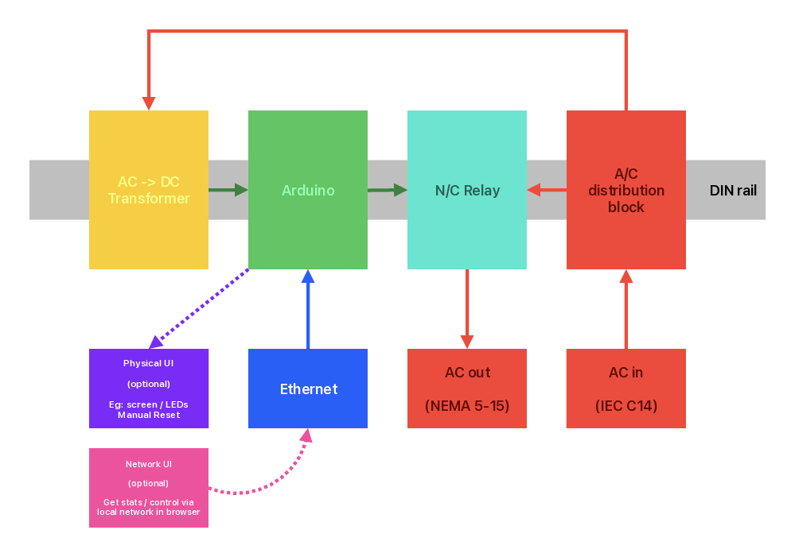

# Net Reset Helper

This is a hardware solution for automatically resetting your modem, router, and switches when your internet connection goes out. A microcontroller monitors the connection by pinging multiple servers periodically and triggers hardware resets when connectivity is lost.

## Overview

The system implements a dual state machine architecture that provides non-blocking internet connectivity monitoring with automatic hardware reset capabilities and visual indicators for connection status.

## Parts and Wiring

You need an Arduino Uno or Mega, an Arduino Ethernet shield, relays for control, a DC power supply, wiring and an enclosure.

**Required Components:**
- Arduino Uno or Mega
- Arduino Ethernet shield
- Normally closed relay (for network equipment reset)
- Normally open relay or LED indicators (for status/recovery signals)
- DC power supply
- Enclosure and wiring

Here is a recommended arrangement:



## Pin Configuration

The system uses four digital output pins for different control and indication purposes:

| Pin | Name | Purpose | Behavior |
|-----|------|---------|----------|
| 8 | FAILURE_STATE_PIN | General status indicator | HIGH whenever system is not in normal state (failure or cooldown) |
| 9 | FAILURE_SIGNAL_PIN | Hardware reset control | HIGH for 1 minute when connection failure detected - drives relay to reset equipment |
| 10 | RECOVERY_SIGNAL_PIN | Recovery indicator | Pulses HIGH for 5 seconds when connection is restored after outage |
| 11 | PINGING_PIN | Activity indicator | Pulses HIGH for 1 second each time a ping request is made |

## State Machine Architecture

The program uses a dual state machine approach for reliable, non-blocking operation:

### 1. System State Machine
Controls the overall connectivity status with three states:

**STATE_NORMAL**
- Normal operation with periodic connectivity checks
- All indicator pins remain LOW except brief pinging pulses
- Transitions to FAILED_SIGNAL when no successful pings for 5 minutes

**STATE_FAILED_SIGNAL**  
- Connection considered lost
- FAILURE_STATE_PIN goes HIGH (general failure indicator)
- FAILURE_SIGNAL_PIN goes HIGH for 1 minute (triggers relay to reset networking hardware)
- Automatically transitions to COOLDOWN after 1 minute

**STATE_COOLDOWN**
- Actively monitoring for connection recovery
- FAILURE_STATE_PIN remains HIGH (still not normal)
- FAILURE_SIGNAL_PIN returns to LOW (network equipment powered back on)
- Lasts 5 minutes, then returns to NORMAL if no recovery detected
- If connection recovers during this period, immediately returns to NORMAL

### 2. Ping Process State Machine
Manages non-blocking HTTP requests with five states:

**PING_IDLE** → **PING_CONNECTING** → **PING_SENDING** → **PING_READING** → **PING_DONE**

Each ping attempts an HTTP GET request to one target, rotating through the list on each attempt.

## Timing & Behavior

| Parameter | Duration | Purpose |
|-----------|----------|---------|
| Ping Interval | 30 seconds | How often to test connectivity |
| Failure Threshold | 5 minutes | Time without success before triggering failure |
| Failure Signal Duration | 1 minute | Duration of HIGH signal on failure pin (relay activation) |
| Cooldown Period | 5 minutes | Active recovery monitoring period |
| Recovery Pulse Duration | 5 seconds | Duration of HIGH signal on recovery pin |
| Pinging Pulse Duration | 1 second | Duration of HIGH signal on pinging activity pin |

## Target Servers

The system rotates through multiple internet targets for redundancy:
- www.google.com
- www.amazon.com  
- www.microsoft.com
- www.cloudflare.com

These targets are easily configurable by modifying the `targets[]` array in the source code.

## Process Flow

```
Power On → DHCP Setup → Begin Normal Monitoring
    ↓
Normal State: Ping every 30 seconds (pinging pin pulses)
    ↓ (5 minutes of failures)
Failed State: 
    - General failure pin HIGH
    - Hardware reset pin HIGH for 1 minute
    ↓
Cooldown State: 
    - General failure pin remains HIGH
    - Hardware reset pin goes LOW (equipment powers back on)
    - Monitor for recovery (5 minutes max)
    ↓ (success) OR (timeout)
Recovery: 
    - All pins return to LOW
    - Recovery pin pulses for 5 seconds
    OR
Return to Normal evaluation (if timeout without recovery)
```

## Hardware Integration

**Network Equipment Reset (Pin 9)**
- Connect to a normally closed relay controlling power to your networking equipment
- When pin goes HIGH, relay opens and cuts power to modem/router/switches
- After 1 minute, pin goes LOW, relay closes, and equipment powers back on

**Status Indicators**
- **General Failure (Pin 8)**: Drive an indicator LED to show when system is not in normal operation
- **Recovery Signal (Pin 10)**: Drive an indicator LED or notification device to signal when connectivity is restored
- **Activity Indicator (Pin 11)**: Drive an LED to show ping activity and confirm system is operating

## Network Configuration

The system uses DHCP for automatic network configuration. The MAC address is predefined in the code but should be unique on your local network. You can modify the MAC address in the `mac[]` array if needed.


## Installation

1. Connect Arduino Ethernet shield to your Arduino Uno/Mega
2. Wire the four output pins to your control relays and indicator LEDs as needed
3. Connect Ethernet cable from shield to your network switch/router
4. Upload the sketch to your Arduino
5. Connect power and monitor via Serial console for status

The system will automatically:
- Obtain an IP address via DHCP
- Begin connectivity monitoring
- Control your networking hardware and provide status indicators as configured

## Monitoring and Debugging

Connect to the Arduino's serial port at 9600 baud to see detailed operational logs including:
- DHCP configuration status
- Ping attempt results and response times
- State transition notifications
- Failure and recovery events
- Timing information for all operations

## Details

For more technical details about the implementation, see the comprehensive code comments and state machine documentation within the source code.